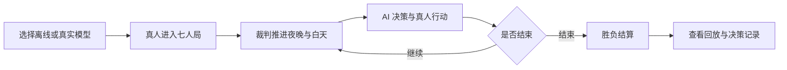

<h1 align="center">AI 狼人杀 · 真人与多智能体对战原型</h1>

<p align="center"><strong>在浏览器或终端中与 6 名 AI 对局，查看辅助建议，并在结束后复盘发言、行动与决策记录。</strong></p>

<p align="center">
  
  
  
</p>

本仓库是狼人杀引擎与交互原型，当前可体验的主要路径是 **1 名真人 + 6 名 AI**。默认使用离线 Mock AI，无需 API Key；也可以配置 OpenAI 兼容接口，让真实模型参与发言和决策。

仓库还提供 AI 自博弈、策略评测、Copilot 校准、六种人格配置与 JSON 回放，适合验证玩法、研究多智能体行为，以及复用已有产品模块。

## 📍 仓库定位

| 仓库 | 主要用途 | 说明 |
| --- | --- | --- |
| 本仓库 `ai-werewolf` | 早期引擎与可玩交互原型 | 独立裁判实现，包含浏览器对局、人格、辅助与回放模块 |
| `ai-werewolf-mvp` | 后续产品开发 | 采用 deepwolf 规则内核，单独建设持久化会话与 React 前端；具体进度以该仓库默认分支为准 |

房间、匹配、语音帧传输、战绩和管理后端等底层模块已存在，但它们不等于全部接入了当前网页。当前网页重点覆盖单真人对局，多真人在线大厅、完整语音通话和管理界面不应视为已经交付。

## 📊 工作流程



## ✨ 功能特性

| 能力 | 当前实现 |
| --- | --- |
| 浏览器对局 | FastAPI + WebSocket，支持发言、投票、角色行动、结算与回放 |
| 终端对局 | `play` 提供单真人与 AI 对战，`simulate` 观看 AI 自博弈 |
| AI 人格 | 质疑者、老好人、分析家、激进派、和事佬、话痨，独立于游戏身份分配 |
| 模型接入 | 默认离线 Mock，可配置 OpenAI 兼容服务 |
| 裁判与信息隔离 | 显式状态机；玩家通过自己的 `PlayerView` 获得可见信息 |
| Copilot 辅助 | 狼人概率、理由与行动建议，另有 Brier Score 校准工具 |
| 回放与解释 | 保存事件与决策记录，支持 JSON 导出及文本回放 |
| 批量评测 | 机器人策略评测、阵营胜率分析与 WebSocket 验收工具 |
| 底层扩展模块 | 房间、匹配、传输、战绩、管理后端，可供进一步开发 |

回放中的决策理由是程序记录或模型生成的解释，不等同于模型内部真实思考过程。记忆模块已存在，但专用记忆摘要尚未完整接入真实模型请求，不应据此宣称已经实现完整长期记忆。

## 🧱 技术栈

| 层 | 技术 |
| --- | --- |
| 规则与产品逻辑 | Python 3.10+ |
| 网页服务 | FastAPI、Uvicorn、WebSocket |
| 浏览器界面 | HTML、CSS、JavaScript |
| 模型与终端 | HTTPX、OpenAI 兼容接口、Rich |
| 运行状态与回放 | 进程内房间状态、JSON 回放文件 |
| 开发检查 | pytest、Ruff、mypy |

## 📁 目录结构

```text
ai_werewolf/
├── domain/          # 角色、动作、规则、裁判、事件与决策记录
├── players/         # 真人、随机机器人、模型机器人
├── ai/              # 模型接口、Mock、人格、对话与记忆模块
├── copilot/         # 辅助建议和概率校准
├── server/          # 房间、会话、匹配、管理与 WebSocket 服务
├── static/          # 可玩的浏览器页面
├── transport/       # 内存与队列等传输实现
├── replay/          # 回放记录、保存与加载
├── stats/           # 战绩与统计模块
├── benchmark.py     # 批量评测
├── balance.py       # 阵营胜率分析
├── app.py           # 基础 HTTP 适配器
└── cli.py           # 命令行入口，serve 启动可玩网页
PRD/                 # 产品、协议与验收文档
tests/               # 自动化测试
```

## 🚀 快速开始

以下示例适用于 macOS / Linux，需要 Git 和 Python 3.10+。

### 1. 安装依赖

```bash
git clone https://github.com/RoourChen/ai-werewolf.git
cd ai-werewolf
python3 -m venv .venv
source .venv/bin/activate
python -m pip install -e '.[dev,server]'
```

`server` 包含网页与 WebSocket 依赖，`dev` 包含测试和代码检查工具。只使用命令行时可安装 `.[dev]`，运行包含服务端的完整测试时需同时安装 `server`。

### 2. 打开浏览器体验

```bash
ai-werewolf serve --host 127.0.0.1 --port 8123
```

浏览器访问 [http://127.0.0.1:8123](http://127.0.0.1:8123)，选择离线模式并按页面提示创建、开始对局。该命令启动 `server/ws.py` 中的可玩网页服务；单独启动 `app.py` 的基础 HTTP 接口不会得到同样的对局页面。

### 3. 使用终端

```bash
# 观看 AI 自博弈，默认离线
ai-werewolf simulate --players 7 --seed 1

# 真人入座，其余六席由 AI 补齐
ai-werewolf play --seed 1

# 批量评测随机机器人
ai-werewolf arena --games 20 --bots random

# 校准 Copilot 概率
ai-werewolf calibrate --games 40

# 保存和读取回放
ai-werewolf simulate --transcript game.json --seed 1
ai-werewolf replay game.json
```

`play` 当前固定为七人局，由程序安排真人座位，不接受 `--players` 或 `--seat` 参数。其他命令及参数可通过 `ai-werewolf --help` 和各子命令的 `--help` 查看。

## ⚙️ 接入真实模型

```bash
cp .env.example .env
```

编辑 `.env`，填写服务地址、模型和密钥，再运行。

```bash
ai-werewolf simulate --provider env
# 或体验真人对战
ai-werewolf play --provider env
```

| 变量 | 用途 |
| --- | --- |
| `AIWEREWOLF_API_KEY` | 真实模型必需的密钥 |
| `AIWEREWOLF_MODEL` | 你的服务实际支持的模型 ID |
| `AIWEREWOLF_PROVIDER` | 服务预设，代码提供 openai、deepseek、mimo、groq、openrouter |
| `AIWEREWOLF_BASE_URL` | 自定义兼容接口地址，优先于服务预设 |
| `AIWEREWOLF_TIMEOUT` | 每次模型请求超时，代码默认 20 秒 |
| `AIWEREWOLF_TEMPERATURE` / `AIWEREWOLF_MAX_TOKENS` | 生成参数，以模型能力为准 |
| `AIWEREWOLF_JSON_MODE` / `AIWEREWOLF_THINKING` | JSON 输出与思考模式开关 |

配置加载器会读取当前目录 `.env`，已存在的环境变量优先。模板中的服务与模型只是配置示例，实际可用性需以服务方为准。真实模型调用可能产生费用；程序中的费用估计不能代替服务商账单。不要把密钥写入代码、日志、回放或 Git。

## 🧩 Python API

```python
from ai_werewolf import GameConfig, Referee, RandomBot, build_roster


def decider(view, request):
    return RandomBot(request.actor).decide(view, request)


state = Referee(GameConfig(roster=build_roster(7), seed=1), decider).run()
print(state.winner, "在", state.day, "天后获胜")
```

`Referee` 负责规则推进，应用层负责连接与会话。公开事件与私密事件按可见范围分发；固定 seed 结合确定性策略可用于复现，真实模型输出不保证逐次相同。

## 🧪 开发与验证

在已安装 `.[dev,server]` 的虚拟环境中运行。

```bash
pytest
ruff check .
mypy ai_werewolf
```

这些命令分别检查测试、代码规范和类型。测试通过与模拟胜率不等于真实玩家体验已经通过验收，真人试玩仍需按验收文档执行。

## 📌 当前边界

- 网页房间状态保存在进程内。连接中断后的恢复依赖仍在运行的服务，重启进程不能恢复原房间。
- 默认启动命令只监听本机。公开部署需要另行配置持久化、访问控制和运行保障。
- 底层语音帧、管理、匹配与战绩模块应按实际接入程度使用，当前网页没有承诺完整的多人平台能力。
- Copilot 概率、人格表现和生成的解释属于辅助信息，不保证判断正确。

## 📚 更多文档

- [架构设计](PRD/03_产品设计/架构设计.md)
- [单真人闭环规格与验收](PRD/01_主PRD/单真人垂直闭环-规格与验收.md)
- [WebSocket 协议设计](PRD/03_产品设计/单真人WebSocket设计.md)
- [交互页面与真人 UX 验收](PRD/10_交互页面与真人UX验收/00_里程碑与验收.md)
- [更新记录](CHANGELOG.md)

## 📄 来源与许可证

本项目受 [deepwolf](https://github.com/JuneQQQ/deepwolf) 启发，面向真人与 AI 多智能体对战独立实现。deepwolf 用于理解产品能力与玩法，本仓库未复用其源码、测试、Prompt 或目录结构。

许可证为 [MIT](LICENSE)，实际第三方复用声明见 [THIRD_PARTY_NOTICES.md](THIRD_PARTY_NOTICES.md)。
